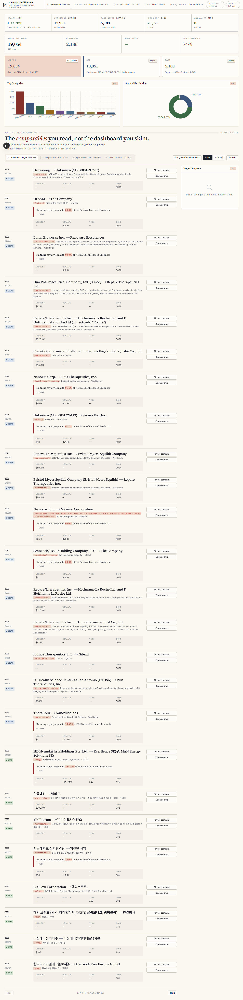
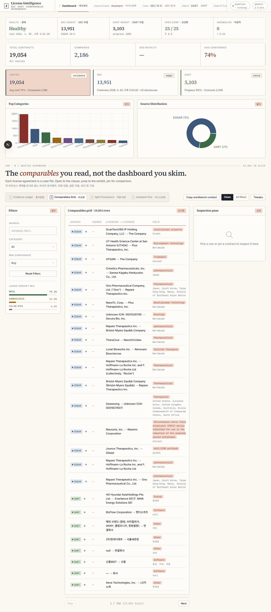
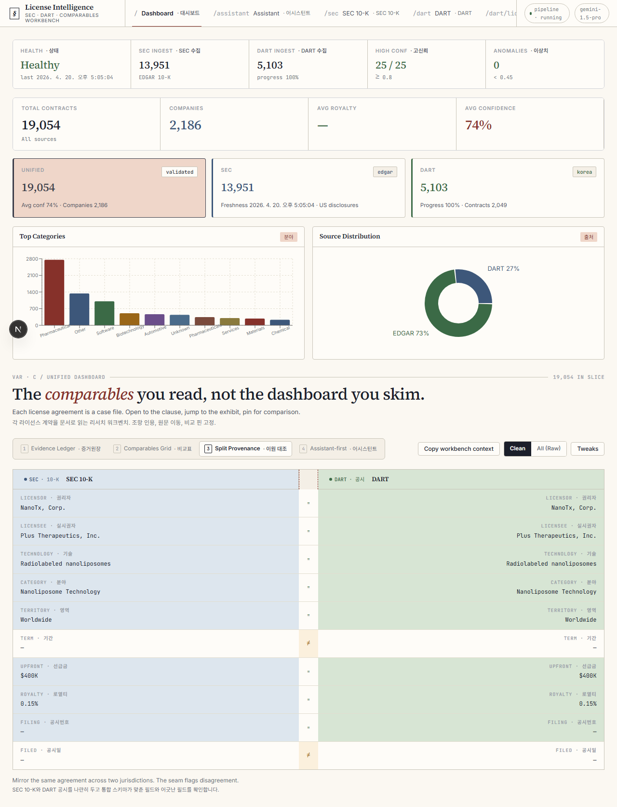
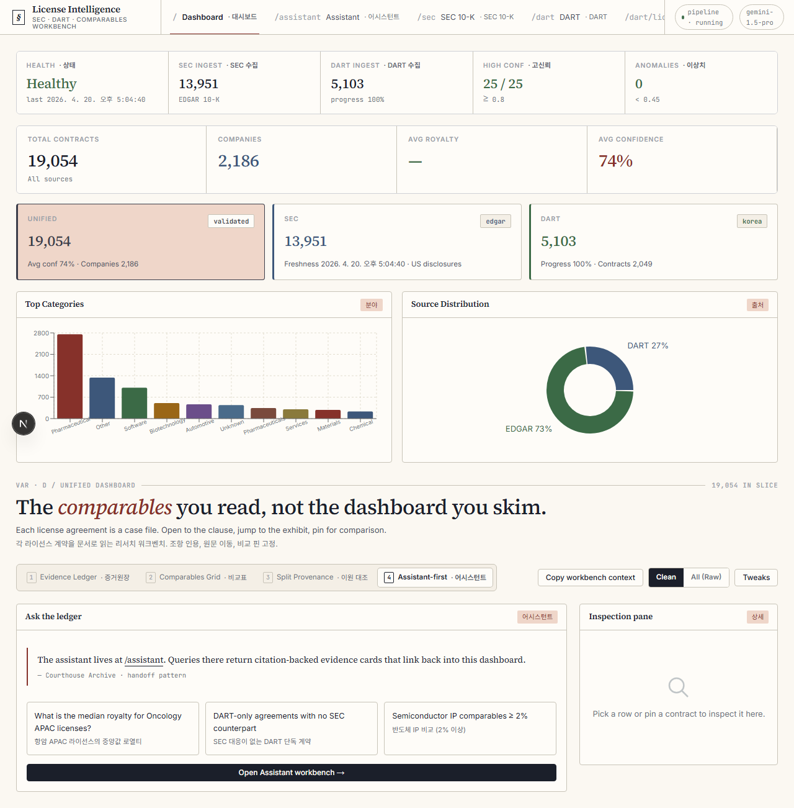
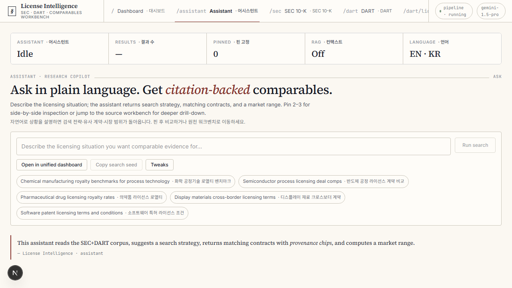
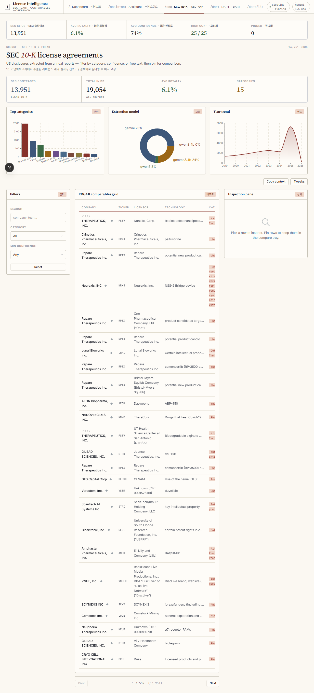
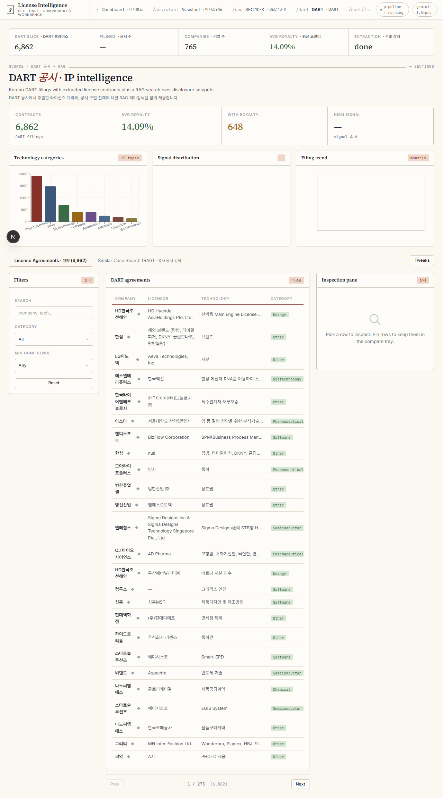

# 10-k-therapy

> **Reading 10-Ks shouldn't hurt this much.**

38,114 SEC EDGAR + DART 공시를 훑어서 라이선스 계약 19,054건을 뽑아냈습니다.
2,186개 회사, 1,546건의 로열티 관측치. 원문은 안 읽어도 됩니다. 그게 이걸 만든 이유입니다.

SEC 10-K와 DART 주요사항보고서에서 라이선스 계약 조건(로열티율 · 선급금 · 기간 · 영역 · 배타성 · 분야)을
AI 로 구조화해서 비교·검색·기술가치평가까지 연결하는 파이프라인입니다.
Next.js Courthouse Archive 디자인의 analyst workbench 가 포함돼 있습니다.



## Dashboard variations

4 가지 분석 레이아웃. 키보드 `1` – `4` 또는 화면 상단 picker 로 전환.

| | | |
|---|---|---|
| **A. Evidence Ledger** — 문서 중심, 계약별 case-file 세로 스택 + 조항 인용 | **B. Comparables Grid** — 고밀도 pivot grid + 정렬·pin·필터 | **C. Split Provenance** — SEC ◁▷ DART 한미 공시 미러링 + diff seam |
|  |  |  |

**D. Assistant-first** — 자연어 질의 우측에 citation 기반 evidence card


## Other routes

### `/assistant` — Research copilot
Natural-language query. Returns search strategy, matching contracts with provenance chips, market range.


### `/sec` — SEC 10-K workbench
Filters · charts · compare tray · inspection pane for EDGAR contracts.


### `/dart` — DART 공시 workbench + RAG
License Agreements tab + RAG similar-case search across disclosure sections.


## What this actually does

- Pulls license contracts out of SEC 10-K exhibits (usually Exhibit 10.x) and DART 주요사항보고서
- Normalizes them into a unified schema so SEC vs DART is apples to apples
- Builds comparables: royalty bands, upfront bands, term distributions by field-of-use
- Runs RAG-backed similar-case search over raw disclosure sections (Korean + English)
- Computes DCF + comparable-based technology valuation
- Serves it all through a Next.js workbench with 4 analyst layouts (Evidence Ledger · Comparables Grid · Split Provenance · Assistant-first)

## 제품 개요

- 목표: 비정형 공시 문서를 분석 가능한 정형 데이터로 변환
- 입력: SEC/DART 원문 문서, CourtListener 소송 데이터
- 출력: `license_summary.json`, 통합 스키마 JSON, CSV 리포트, SQLite 분석 DB, 대시보드
- 활용: 라이선스 계약 조건 비교, 기술 카테고리별 패턴 분석, valuation 가정 근거 데이터 축적
- 비목표: 법률 자문 자동화, 투자 의사결정 자동 실행

## Why this exists

공시 라이선스 계약 정보는 투자 의사결정, 기술가치평가, 로열티 벤치마크 등에 핵심이지만
원문이 PDF/HTML 속 각주와 Exhibit 에 흩어져 있어서 사람이 찾기 고통스럽습니다.
38,114건 중 실제 라이선스 계약이 19,054건, LLM-as-Judge 검증 기준 real-license rate 79.3%.

This isn't here to replace lawyers. It's here so you stop reading 10-K footnotes at 2am.

## 현재 코드 스캔 요약 (2026-02-28)

- SEC 파이프라인: `crawler -> parser -> extractor -> scan_licenses` 흐름이 코드로 분리되어 있음
- DART 파이프라인: `orchestrator/run_dart_pipeline.py`에서 단일 기업/전체 상장사 청크 실행 지원
- 통합 파서: `parser/unified_disclosure_parser.py`가 SEC/DART 공통 스키마 출력 지원
- 분석 계층: `database/build_sqlite_db.py`, `utils/analyze_sqlite.py`로 로컬 분석 루프 구성
- UI: Streamlit 대시보드 + Next.js 대시보드 병행 제공
- 테스트: DART 크롤러/파서, 통합 파서에 대한 단위 테스트 존재

## 빠른 시작

### 1. 설치

```powershell
cd F:\SEC\License\sec-license-extraction
python -m venv .venv
.\.venv\Scripts\Activate.ps1
pip install -r requirements.txt
```

### 2. 설정 파일 준비

```powershell
Copy-Item .\config_demo.yaml .\config.yaml -Force
Copy-Item .\.env.example .\.env -Force
```

### 3. 필수 환경 변수

- `GEMINI_API_KEY` 또는 로컬 LLM 사용 시 `OLLAMA_BASE_URL`
- `DART_API_KEY` (DART 파이프라인 실행 시)
- `COURTLISTENER_API_KEY` (소송 수집 실행 시)
- `DB_PASSWORD` (PostgreSQL 로더 사용 시)

## 사용 방법

### A. SEC 라이선스 추출

1. SEC 원문 수집

```powershell
python -c "from crawler.sec_crawler import SECEdgarCrawler; SECEdgarCrawler('config.yaml').batch_process()"
```

1. 노트 파싱 및 후보 추출

```powershell
python -c "from parser.html_parser import batch_process; batch_process('config.yaml')"
```

1. LLM 기반 구조화 추출

```powershell
python -c "from extractor.license_extractor import batch_process; batch_process('config.yaml')"
```

1. 요약 스캔 생성

```powershell
python scan_licenses.py
```

### B. DART 통합 스키마 생성

1. 단일 종목 실행

```powershell
python -m orchestrator.run_dart_pipeline `
  --config config.yaml `
  --stock-code 005930 `
  --start-date 20240101 `
  --end-date 20260220 `
  --max-filings 2
```

1. 전체 상장사 청크 실행

```powershell
powershell -ExecutionPolicy Bypass -File scripts\run_dart_listed_chunks.ps1 `
  -StartOffset 0 `
  -EndOffset 2000 `
  -ChunkSize 200 `
  -MaxFilingsPerTarget 1
```

### C. 소송 데이터 수집

```powershell
python orchestrator\run_pipeline.py --config config.yaml
```

- 참고: 현재 `run_pipeline.py`는 SEC 단계가 주석 처리되어 있으며, 실질적으로 Litigation 수집 중심으로 동작합니다.

### D. 가치평가 리포트 생성

```powershell
python orchestrator\run_valuation.py --config config.yaml
```

### E. SQLite 분석 DB 구축 및 리포트

1. DB 구축

```powershell
python database\build_sqlite_db.py
```

1. 분석 리포트 생성

```powershell
python utils\analyze_sqlite.py `
  --db-path data/processed/sec_dart_analytics.db `
  --out data/exports/analysis/sqlite_analysis_latest.md
```

### F. 대시보드 실행

1. Streamlit

```powershell
streamlit run dashboard\app.py
```

1. Next.js

```powershell
cd next-finance-dashboard
npm install
npm run sync:data
npm run dev -- --port 3007
```

## 핵심 디렉터리

```text
sec-license-extraction/
  crawler/                  # SEC, DART 크롤러
  parser/                   # SEC 노트 파싱, SEC/DART 통합 파서
  extractor/                # LLM 기반 라이선스 계약 추출
  litigation/               # CourtListener 수집 및 판결 파싱
  valuation/                # DCF + 유사사례 기반 가치평가
  orchestrator/             # 실행 엔트리포인트
  database/                 # PostgreSQL/SQLite 스키마 및 적재
  dashboard/                # Streamlit 대시보드
  next-finance-dashboard/   # Next.js 대시보드
  utils/                    # 운영 보조 스크립트
  tests/                    # 파서/크롤러 테스트
  data/                     # 원천/중간/산출 데이터
```

## 주요 산출물

- `data/raw_filings/`: SEC 원문 공시
- `data/parsed_footnotes/`: SEC 노트 파싱 결과
- `data/extracted_licenses/`: 구조화된 라이선스 추출 결과
- `license_summary.json`: 전체 SEC 스캔 통합 요약
- `data/dart/raw_filings/`: DART 원문 및 메타데이터
- `data/dart/unified_schema/`: DART 통합 스키마 JSON
- `data/litigation/parsed/`: 로열티 판결 파싱 결과
- `data/exports/*.csv`: CSV 리포트
- `data/processed/sec_dart_analytics.db`: 로컬 분석 DB

## 제품을 어떻게 쓸 수 있나

- 리서치: 산업별/기업별 라이선스 계약 패턴을 빠르게 비교
- 전략: 과거 계약 조건과 소송 로열티 데이터를 연결해 협상 벤치마크 확보
- 데이터 엔지니어링: SEC/DART 비정형 문서를 공통 스키마로 적재해 재사용
- 분석 자동화: SQLite 기반으로 반복 가능한 보고서 자동 생성

## 향후 발전 방향

### 1) 안정성/운영

- `litigation/court_crawler.py`에 요청 `timeout`/재시도 정책 표준화
- 파이프라인 단계별 체크포인트/재처리 큐 도입
- 대량 배치 실행 시 처리량/실패율/비용 메트릭 로깅 강화

### 2) 데이터 품질

- 기술 카테고리, 당사자명, 통화/단위 정규화 규칙 고도화
- 추출 신뢰도(`confidence_score`) 기반 재추출 루프 설계
- DART 섹션 점수 모델 개선(정답셋 기반 검증)

### 3) 제품화

- Streamlit/Next 대시보드 지표 통합 및 필터 체계 일원화
- 기업/기술/기간 단위 API 레이어 분리
- 자동 배치 스케줄러와 알림(Slack/Email) 연동

## 운영 메모

- `data/` 용량이 매우 커질 수 있으므로 외장 스토리지 또는 경로 분리를 권장합니다.
- `config.yaml` 내 일부 한글 값이 깨져 보이면 UTF-8로 재입력 후 저장해서 사용하세요.
- 문서 상태 스냅샷 갱신이 필요하면 `python utils/update_readme_status.py`를 참고하되, 현재 스크립트는 인코딩 정리가 선행되면 더 안정적으로 사용할 수 있습니다.
